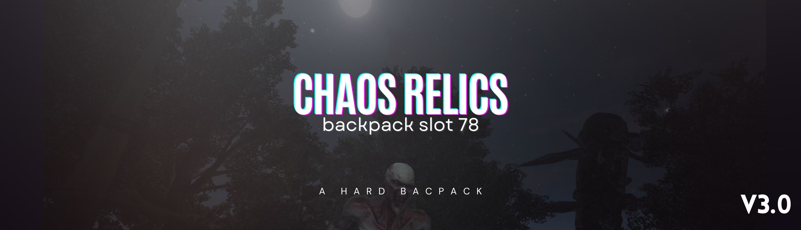

  

  <h1 align="center">Chaos Relics - Backpack Slot(78) - v3.0 (3.0 Compatible)</h3>

  

    (Server side only / server friendly)
     
    Nexusmods: https://www.nexusmods.com/7daystodie/mods/5558
     
  

## 📋 Mod Description

This mod increases the player backpack capacity to **78 slots** in 7 Days to Die. It enhances the gameplay experience by allowing players to carry more items.

### ✨ Features

- **78 Backpack Slots**: Increases default backpack capacity to 78 slots
- **Optimized UI**: Backpack interface optimized with 13 columns x 6 rows layout
- **Server Friendly**: Only requires server-side installation
- **Lightweight Mod**: Doesn't affect performance
- **Easy Installation**: Plug & Play

### 🎯 v2.2 Updates

- UI layout optimizations
- Backpack interface width increased (873px)
- Currency and icon positions repositioned
- Background graphics updated for new dimensions
- Grid system improved (6 rows x 13 columns)
- Carry capacity set to 34

### 🚀 v2.3 (7DTD 3.0 Compatibility)

- Updated XUi patch location to `Config/XUi_InGame`
- Updated backpack window xpaths (`panel` -> `rect`) for 3.0 UI schema
- Updated xui root scale xpaths (`/xui/@scale` and `/xui/@stackpanel_scale`)
- Tightened progression, buffs, and entity xpath targets for 3.0 data layout

### 🧩 v3.0 (Progression + Presets)

- Rebalanced `perkPackMule` carry progression for 3.0 flow: `5,10,17,24,31`
- Tuned `perkNightStalkerThiefAdrenaline` carry bonus to `47` for 78-slot scaling
- Added UI preset files for `16:9`, `21:9` and `4K`

### 📦 Installation

1. Place the mod in your server's `Mods` folder
2. Restart the server
3. Ready to go!

### 📝 Changelog

- See `CHANGELOG.md` for full version history.

### 🖥️ UI Presets

- Active default preset: `Config/XUi_InGame/xui.xml` (`16:9`)
- Optional presets:
  - `UI-Presets/xui_16x9.xml`
  - `UI-Presets/xui_21x9.xml`
  - `UI-Presets/xui_4k.xml`
- To switch preset, use the target preset values in `Config/XUi_InGame/xui.xml`.

### 🔧 Technical Details

- **Backpack Size**: 78 slots
- **Carry Capacity**: 34
- **Grid Layout**: 13 columns x 6 rows
- **UI Width**: 873px
- **UI Height**: 416px
